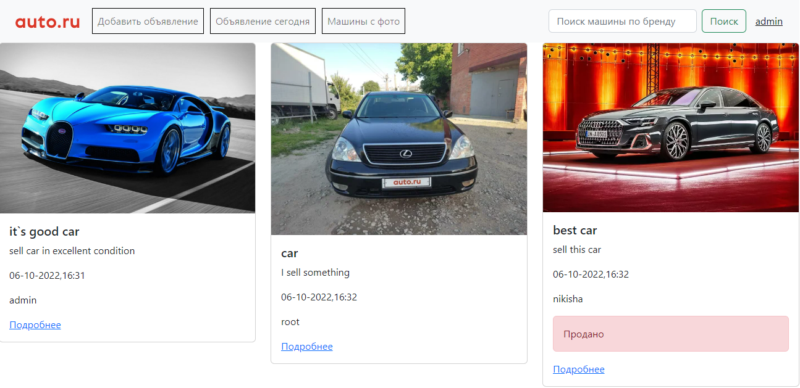
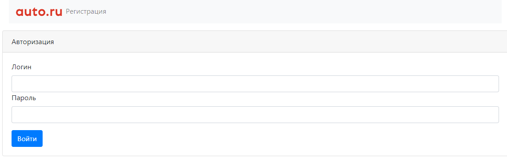
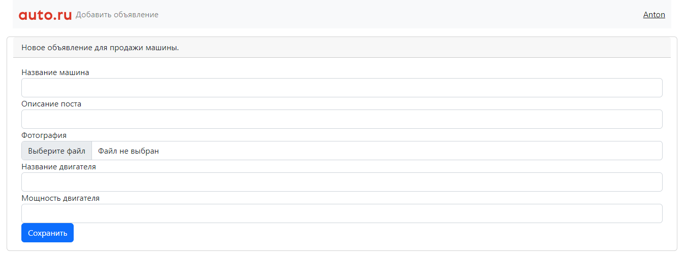

# Сервис по продаже машин

Данное приложение иллюстрирует сайт по продаже машин.
На сайте есть объявления. В объявлении: описание, марка машины, тип кузова, фото. Объявление имеет статус продано или нет.

Стек технологий: 


[](https://hibernate.org/)


## ТЗ:
1. Основная страница. таблица со всеми объявлениям машин на продажу.
2. На странице должна быть кнопка. добавить новое объявление.
3. Переходить на страницу добавления.
4. Должны быть категории машины, марка, тип кузова и тд. Пример с сайта auto.ru.
5. Можно добавлять фото.
6. объявление имеет статус продано. или нет.
7. Должны существовать пользователи. кто подал заявление. только он может менять статус.

Перед запуском установите:

- Java 17
- Apache Maven 3.x
- PostgreSQL 14

## Запуск приложения

1. Создать бд:
```sql
create database car_sales;
```

2. Запуск приложения с maven. Перейдите в корень проекта через командную строку и выполните команды:
```
    mvn clean install
    mvn spring-boot:run
```


### Основная страница со всеми объявлениями и функционалом:


### Страницы с авторизацией и аутентификацией пользователя: 



### Добавление нового объявления:


## Контакты
email: danya.nikisha@mail.ru


