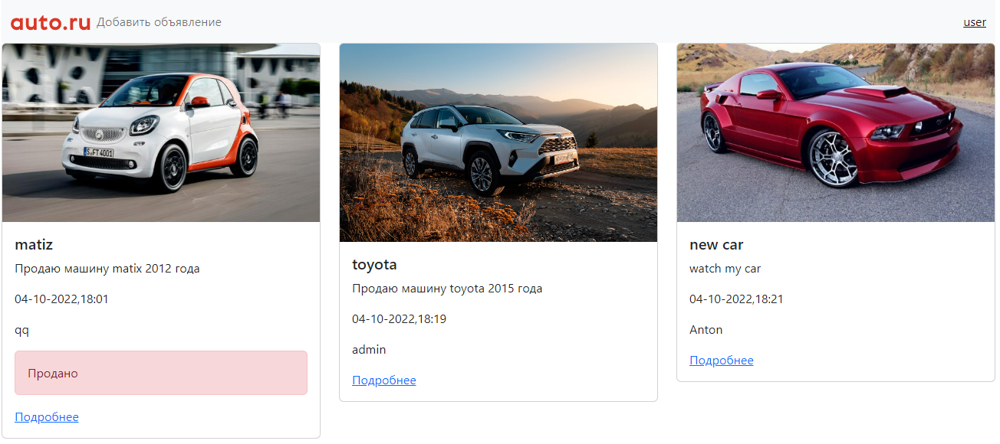
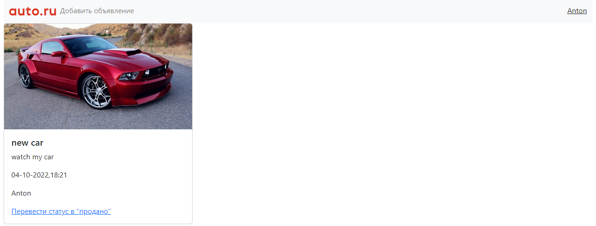

# Job4j_cars

Данное приложение иллюстрирует сайт по продаже машин.
На сайте есть объявления. В объявлении: описание, марка машины, тип кузова, фото. Объявление имеет статус продано или нет.

Стек технологий: 
* Spring boot;
* Thymeleaf;
* Bootstrap;
* hibernate;
* Liquibase;
* H2 Database;
* Mockito;
* Junit;
* Hamcrest.

ТЗ:
1. Основная страница. таблица со всеми объявлениям машин на продажу.
2. На странице должна быть кнопка. добавить новое объявление.
3. Переходить на страницу добавления.
4. Должны быть категории машины, марка, тип кузова и тд. Пример с сайта auto.ru.
5. Можно добавлять фото.
6. объявление имеет статус продано. или нет.
7. Должны существовать пользователи. кто подал заявление. только он может менять статус.

Основная страница со всем объявлениями:

Страницы с авторизацией и аутентификацией пользователя: 

Добавление нового объявления:

Менять статус о продажи машины может только заявитель, другие пользователи не смогут это сделать:
